# Data Normalization and Entity-Relationship Diagramming

## A table containing the original data set
| assignment_id | student_id | due_date | professor | assignment_topic                | classroom | grade | relevant_reading    | professor_email   |
| :------------ | :--------- | :------- | :-------- | :------------------------------ | :-------- | :---- | :------------------ | :---------------- |
| 1             | 1          | 23.02.21 | Melvin    | Data normalization              | WWH 101   | 80    | Deumlich Chapter 3  | l.melvin@foo.edu  |
| 2             | 7          | 18.11.21 | Logston   | Single table queries            | 60FA 314  | 25    | Dümmlers Chapter 11 | e.logston@foo.edu |
| 1             | 4          | 23.02.21 | Melvin    | Data normalization              | WWH 101   | 75    | Deumlich Chapter 3  | l.melvin@foo.edu  |
| 5             | 2          | 05.05.21 | Logston   | Python and pandas               | 60FA 314  | 92    | Dümmlers Chapter 14 | e.logston@foo.edu |
| 4             | 2          | 04.07.21 | Nevarez   | Spreadsheet aggregate functions | WWH 201   | 65    | Zehnder Page 87     | i.nevarez@foo.edu |
| ...           | ...        | ...      | ...       | ...                             | ...       | ...   | ...                 | ...               |

## Your description of what makes this data set not compliant with 4NF

## Tables containing the 4NF-compliant version of the data set

1. The table for Assignment 
|assignment_id|assignment_topic               |relevant_reading   |
|-------------|-------------------------------|-------------------|
|1            |Data Normalization             |Deumlich Chapter 3 |
|2            |Single table queries           |Dümmlers Chapter 11|
|4            |Spreadsheet aggregate functions|Zehnder Page 87    |
|5            |Python and pandas              |Dümmlers Chapter 11|

2. The table for Course
|course_id|course               |
|---------|---------------------|
|1        |sqlite               |
|2        |python               |
|3        |R studio             |
|4        |Javascript           |
|5        |Theory of Probability|

3. The table for Due Date
|scetion_id|assignment_id|due_date|
|----------|-------------|--------|
|1         |4            |04.07.21|
|2         |1            |23.02.21|
|4         |2            |18.11.21|
|7         |5            |05.05.21|
|5         |1            |23.02.21|

4. The table for grade
|student_id|assignment_id|grade|
|----------|-------------|-----|
|1         |1            |80   |
|2         |5            |92   |
|2         |4            |65   |
|4         |1            |75   |
|7         |2            |25   |

5. The table for professor 
|professor_id|professor|professor_email  |
|------------|---------|-----------------|
|1           |Melvin   |l.melvin@foo.edu |
|2           |Logston  |e.logston@foo.edu|
|3           |Nevarez  |i.nevarez@foo.edu|

6. The table for section
|scetion_id|classroom|
|----------|---------|
|1         |WWH 101  |
|2         |60FA 314 |
|4         |60FA 314 |
|5         |WWH 201  |
|7         |WWH 101  |

## The ER diagram(s) you created of your 4NF-compliant version of the data set

## Your description of what changes you made and how these changes make the data 4NF-compliant